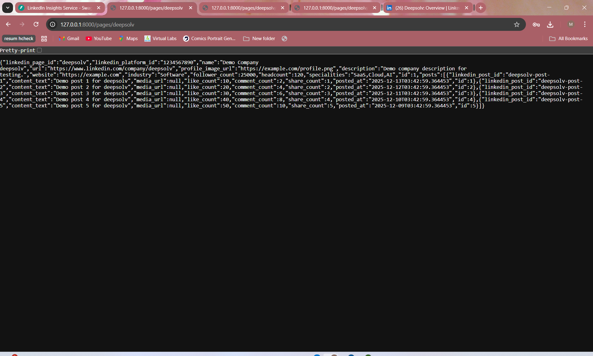
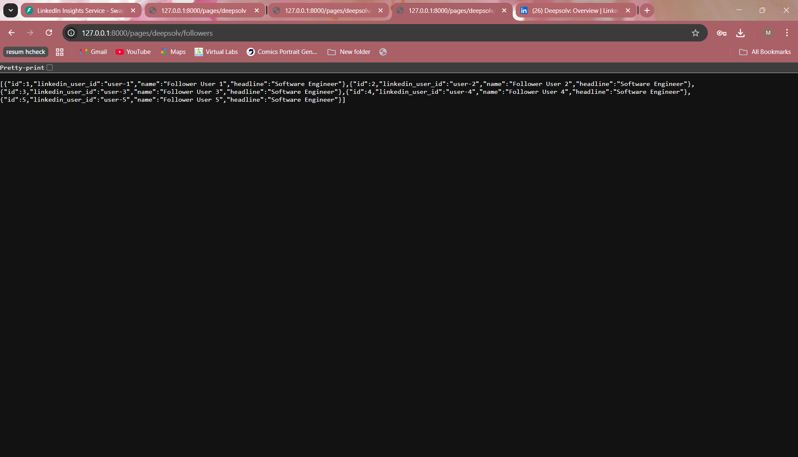
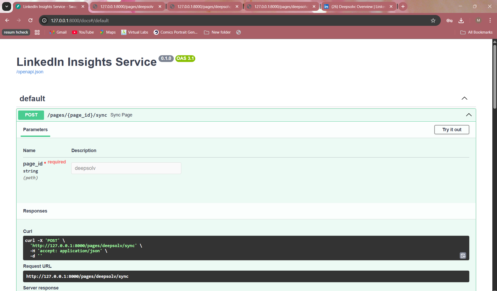

# GenAI-Developer-Intern-
Linkedin Insights Microservice
Here is a concise README you can put in `README.md` at the project root and adjust as needed.

***

# LinkedIn Insights Microservice

A FastAPI‑based microservice that collects and serves insights for LinkedIn company pages. The service scrapes page data (dummy scraper now, real scraper later), stores it in a relational database, and exposes REST endpoints to query pages, posts, and followers.[2][3]

## Features

- Async REST API built with FastAPI and async SQLAlchemy[2][4]
- SQLite database (easily switchable to Postgres)  
- Entities: Page, Post, SocialMediaUser, PageFollower, Employment, Comment  
- Dummy scraper that generates sample data for a given LinkedIn page slug (e.g. `deepsolv`)  
- Filtering pages by name, industry, follower count range  
- Endpoints for recent posts and followers  
- Simple in‑memory caching layer (can be replaced with Redis later)  

***

## Tech stack

- Python 3.10+  
- FastAPI  
- SQLAlchemy 2 (async)  
- SQLite (default) or PostgreSQL  
- Uvicorn ASGI server  

***

## Project structure

```text
linkedin_insights/
├─ app/
│  ├─ __init__.py
│  ├─ main.py          # FastAPI app and routes
│  ├─ config.py        # settings (DB URL, etc.)
│  ├─ database.py      # async engine + session + Base
│  ├─ models.py        # ORM models (Page, Post, etc.)
│  ├─ schemas.py       # Pydantic schemas
│  ├─ deps.py          # DB dependency
│  ├─ scraper.py       # dummy LinkedIn page scraper
│  ├─ crud.py          # DB operations
│  └─ cache.py         # in‑memory cache for pages
├─ linkedin.db         # SQLite DB file (created automatically)
├─ requirements.txt
├─ Dockerfile
└─ README.md
```

***

## Setup and installation

1. Clone the repository and enter the folder:

```bash
git clone <your-repo-url>.git
cd linkedin_insights
```

2. Create and activate a virtual environment:

```bash
python -m venv fastapi_env
fastapi_env\Scripts\activate   # on Windows
# source fastapi_env/bin/activate  # on Linux/macOS
```

3. Install dependencies:

```bash
pip install -r requirements.txt
```

4. Configure environment (SQLite by default).  
   Create a `.env` file in the project root:

```env
DATABASE_URL=sqlite+aiosqlite:///./linkedin.db
```

The app will create `linkedin.db` and all tables automatically on startup using SQLAlchemy’s `create_all`.[22]

***

## Running the server

Start the API with Uvicorn:

```bash
uvicorn app.main:app --reload
```

The server will be available at:

- API root: `http://127.0.0.1:8000`  
- Swagger UI: `http://127.0.0.1:8000/docs`  
- ReDoc: `http://127.0.0.1:8000/redoc`  

***

## Core endpoints

All endpoints are under the root (no version prefix for now).


### 1. Sync a page (scrape + store)

Trigger a scrape and save data for a LinkedIn page slug (e.g. `deepsolv`):

```http
POST /pages/{page_id}/sync
```

Example:

```http
POST /pages/deepsolv/sync
```

This uses `scraper.py` to build dummy data, then persists Page, Posts, and Followers in the database.

### 2. Get page details

```http
GET /pages/{page_id}
```

Example:

```http
GET /pages/deepsolv
```

Returns page metadata and recent posts from the DB (or in‑memory cache).

### 3. List pages with filters

```http
GET /pages?name=deep&industry=Software&followersMin=1000&followersMax=50000&page=1&limit=10
```

- `name`: partial match on page name (case‑insensitive)  
- `industry`: exact match  
- `followersMin` / `followersMax`: follower count range  
- `page`, `limit`: pagination parameters  

### 4. Get recent posts of a page

```http
GET /pages/{page_id}/posts?limit=10
```

Example:

```http
GET /pages/deepsolv/posts?limit=10
```

Returns the most recent posts ordered by `posted_at` descending.

### 5. Get followers of a page

```http
GET /pages/{page_id}/followers?limit=20
```

Example:

```http
GET /pages/deepsolv/followers?limit=20
```

Returns basic information about followers (dummy data from the scraper).

***

## Development notes

- The current `scraper.py` generates mock data for testing.  
  Replace it with a real scraper using Playwright or an API when ready, taking care to respect LinkedIn’s terms and legal constraints.[24]
- `cache.py` currently uses a simple in‑memory dict. This can be swapped for a Redis‑based implementation by changing `get_cached_page` and `set_cached_page` and running a Redis server.[26]
- Switching to PostgreSQL only requires changing `DATABASE_URL` in `.env` and ensuring the database exists.

***

## Postman collection

You can export the following requests into a Postman collection:

- `POST /pages/{page_id}/sync`  
- `GET /pages/{page_id}`  
- `GET /pages` with different filters  
- `GET /pages/{page_id}/posts`  
- `GET /pages/{page_id}/followers`  

Save the exported JSON as `postman_collection.json` in the repo for easier review.

***
## Screenshots

### Page details endpoint


### Posts endpoint


### Followers endpoint


### Overall UI

